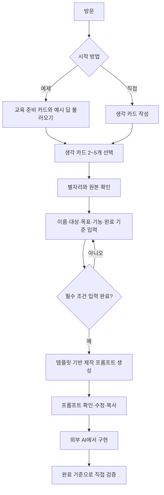

# 사용자 흐름

K·L은 외부 활동으로, 이번 프로토타입은 안내만 제공한다. 카드/조건의 수정은 이전 버튼으로 이동한다. 프롬프트는 다시 생성할 때 갱신된다. 현재 단계와 작업은 동일 브라우저에 저장한다.

## 이후 선택적 AI

명시적 요청 → 전송 카드와 비용/한도 확인 → 서버 AI 호출 → 원본과 제안 비교 → 사용자 채택 → 입력 갱신. 생성 실패 시 수동 경로를 유지한다. 미구현이다.
