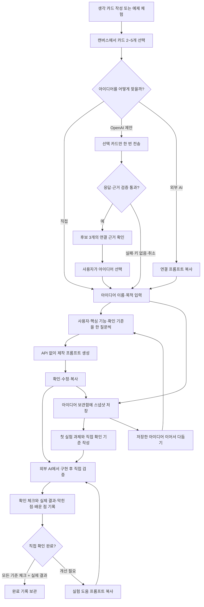

# 별이음 사용자 흐름 v0.3

AI 대기 중에도 카드 조작 가능. 요청 도중 원본/선택이 바뀌면 이전 결과를 무시한다. AI 제안은 확정 판단이 아닌 초안이다. 모바일은 드래그 대신 선택을 사용하며 개별/전체 해제가 가능하다. M의 구현·실행은 외부 활동이며, 별이음에는 기준 체크와 관찰 기록을 남긴다. 아이디어 보관함·첫 실험·기록은 API 없이 작동한다.
