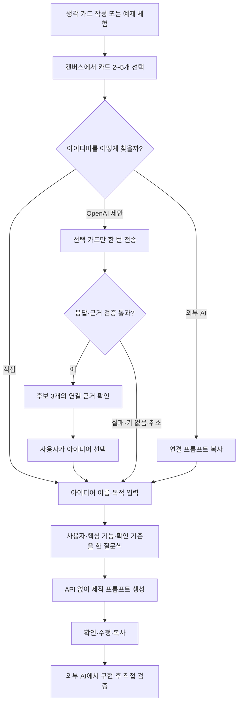

# 별이음 사용자 흐름 v0.2

```mermaid
flowchart TD
 A[생각 카드 작성 또는 예제 체험] --> B[캔버스에서 카드 2~5개 선택]
 B --> C{아이디어를 어떻게 찾을까?}
 C -->|직접| D[아이디어 이름·목적 입력]
 C -->|OpenAI 제안| E[선택 카드만 한 번 전송]
 C -->|외부 AI| F[연결 프롬프트 복사]
 E --> G{응답·근거 검증 통과?}
 G -->|예| H[후보 3개의 연결 근거 확인]
 H --> I[사용자가 아이디어 선택]
 I --> D
 G -->|실패·키 없음·취소| D
 F --> D
 D --> J[사용자·핵심 기능·확인 기준을 한 질문씩]
 J --> K[API 없이 제작 프롬프트 생성]
 K --> L[확인·수정·복사]
 L --> M[외부 AI에서 구현 후 직접 검증]
```

AI 대기 중에도 카드 조작 가능. 요청 도중 원본/선택이 바뀌면 이전 결과를 무시한다. AI 제안은 확정 판단이 아닌 초안이다. 모바일은 드래그 대신 선택을 사용한다. M은 외부 활동으로 안내만 제공한다.
